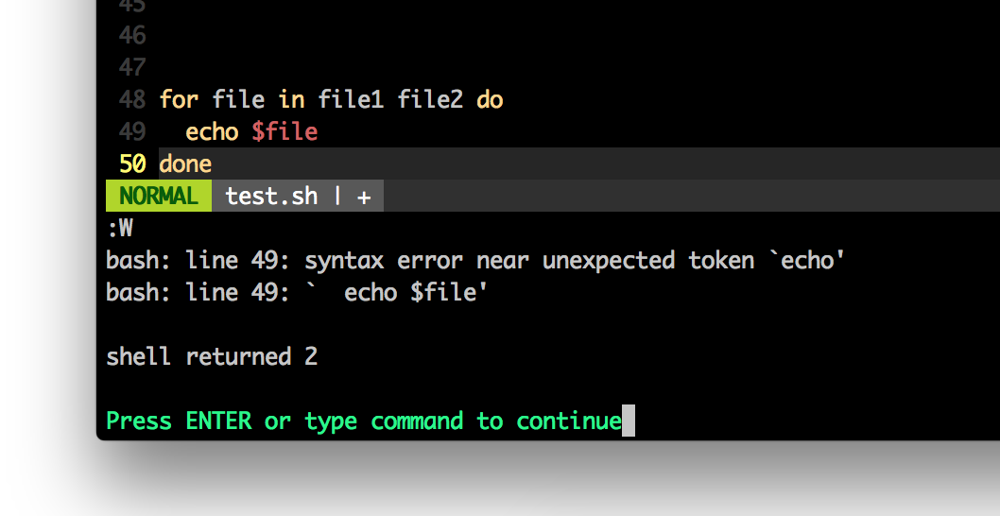

# Syntax check for vim

This repository contains several languages' syntax check for vim.
Current supporting languages are:

* perl
* perl6
* ruby
* bash

You can check syntax by `:W` command.

The original is the perl version http://www.vim.org/scripts/script.php?script_id=896
by Ricardo Signes.

# How to install

With [NeoBundle](https://github.com/Shougo/neobundle.vim):

    " In your ~/.vimrc
    NeoBundle 'shoichikaji/synwrite.vim'
